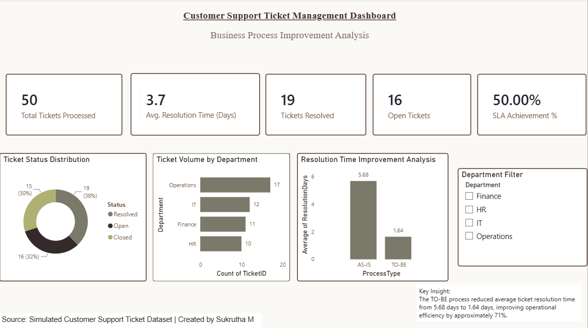

# Customer Support Ticket Management System

## Project Overview

This project demonstrates an end-to-end Business Analysis engagement focused on improving customer support ticket management processes.

The objective was to identify process inefficiencies, document business requirements, design future-state workflows, and visualize operational performance through a Power BI dashboard.
## Dashboard Preview



---

## Business Problem

The existing customer support process relied on manual ticket tracking, resulting in:

- Delayed ticket resolution
- Lack of SLA visibility
- Manual assignment of tickets
- Limited management reporting

---

## Project Objectives

✅ Improve ticket tracking

✅ Reduce resolution time

✅ Increase SLA compliance

✅ Improve operational visibility

✅ Standardize support workflows

---

## Tools Used

| Tool | Purpose |
|--------|----------|
| Microsoft Excel | Data preparation |
| BPMN | Process Mapping |
| Jira | Agile Project Management |
| Power BI | Dashboard & Reporting |
| Microsoft Word | BRD Documentation |

---

## Project Deliverables

### Business Requirement Document (BRD)

Defined:
- Business objectives
- Functional requirements
- Stakeholders
- Scope and assumptions

### BPMN Process Diagrams

Created:
- AS-IS Process
- TO-BE Process
## AS-IS Process


## TO-BE Process


### Gap Analysis

Identified:
- Current state gaps
- Improvement opportunities
- Business impacts

### User Stories & Agile Artifacts

Created:
- User Stories
- Acceptance Criteria
- Jira Backlog
- Sprint Tracking

### Power BI Dashboard

KPIs Included:

- Total Tickets Processed
- Average Resolution Time
- Open Tickets
- Resolved Tickets
- SLA Compliance Rate

---

## Key Findings

- Average Resolution Time reduced from **5.68 days** to **1.64 days**
- Operational efficiency improved by approximately **71%**
- Enhanced visibility into ticket status and department workloads
- Improved SLA monitoring capabilities

---

## Repository Structure

```text
Customer-Support-Ticket-Management-System
│
├── BPMN Diagrams
├── BRD
├── Dashboard
├── Gap Analysis
├── Jira
└── README.md
